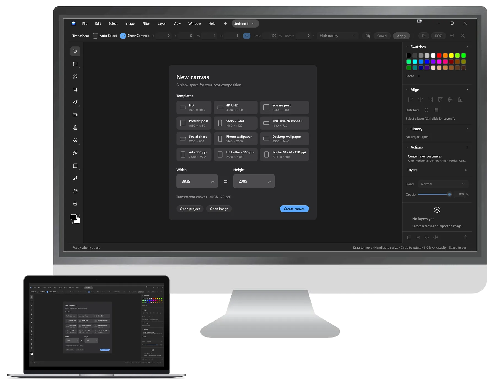

# Layer Form Wiki

Layer Form is a free, open-source image editor for Windows 10 (1809) and later. It is built around a non-destructive, layer-based workflow: import images, arrange them in a document, retouch or adjust them, then export a finished image or save a `.comp` project for later.

## Getting started

1. Install `LayerForm-Setup-1.2.0.exe`. It installs only for your Windows user account and does not need administrator rights.
2. Choose **File > New** to create a canvas, or **File > Open Image** to begin from an image.
3. Use the **Move** tool to select a layer and drag it. Handles resize it; the corner control rotates it.
4. Save editable work as a `.comp` project. Use **File > Export** for PNG or JPEG output.

## Text editing

Layer Form 1.2.0 adds editable text layers.

- Choose the **Type** tool (`T`) before clicking on the canvas.
- Click an empty area to create text, or click existing text to place the caret in that text at its current position.
- Type, select, delete and add line breaks directly on the canvas. There is no separate preview box or modal text window.
- Press **Escape** or choose another tool to finish editing.
- Use the **Character** panel to change font, size, color, alignment, tracking, leading and paragraph bounds.
- Choose the **Move** tool when you want to select, drag, resize or rotate a text layer instead of editing it.

Text remains editable when saved in a current `.comp` project. A raster fallback is included so older app versions can still render the project.

## Rulers, grids and slices

Turn on rulers and configure a layout grid for precise composition. Use the **Slice** tool to create a manual export rectangle, or divide an area into rows and columns. Slice export writes individually numbered PNG files, which is useful for web, UI and sprite assets.

## Layers and effects

Use the Layers panel to create image, text, shape, adjustment and folder layers. Folders can be duplicated with their nested contents and clipping-mask relationships preserved. Layer and folder opacity, masks, blend modes (including Soft Light), custom layers and layer locking are all supported.

## Updates and support

Layer Form checks its secure update feed at launch and can download a verified installer automatically. You can also choose **Help > Check for Updates**. Use **Help > Report a Bug** or **Help > Request a Feature** to open the corresponding GitHub form.

For the complete release history, see [CHANGELOG.md](../CHANGELOG.md). For build and release instructions, see [RELEASING.md](RELEASING.md).
